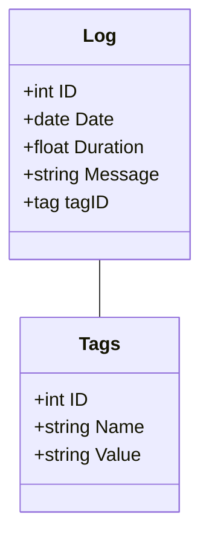

# Worklogger

Worklogger is a simple command line tool to log your work hours.
It is designed to be simple and easy to use.

```mermaid
  %%{ "theme": "dark" }%%
  classDiagram
    class Tags {
        +int ID
        +string Name
        +string Value
    }

    class Log {
        +int ID
        +date Date
        +float Duration
        +string Message
        +tag tagID
    }

    Log -- Tags
```
